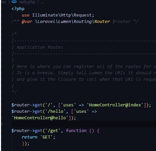

MODEL, CONTROLLER DAN REQUEST-RESPONSE
HANDLER
------------------------------------------------
Langkah 1) Tabel users yang telah dibuat pada modul sebelumnya. Kolom id merupakan primary key
yang di-generate secara auto increment, kolom createdAt merupakan kolom yang
menunjukkan timestamp kapan data dibuat, kolom updatedAt merupakan kolom yang
menunjukkan timestamp kapan data dimodifikasi, kolom name untuk nama user, dan
kolom email untuk alamat email user.

Langkah 2) Membuat file HomeController.php dan menambahkan fungsi index(),Mengubah route /
pada file routes/web.php agar memanggil fungsi index() di HomeController dan
Menjalankan aplikasi Lumen.

Langkah 3) Menambahkan library baru pada file HomeController.php,Mengubah fungsi index pada
file HomeController.php

Langkah 4) Penggunaan pustaka respons dalam file HomeController sangat penting untuk membuat
dan mengirimkan respons HTTP. Dalam konteks ini, kita akan menambahkan fungsi
"hello" ke dalam file HomeController.php. Fungsi ini akan menghasilkan respons dengan
status kode 201 (Created), header "Content-Type" yang menunjukkan jenis kontennya
sebagai JSON, dan data JSON yang berisi status 'Success' dan pesan 'Hello, from
Lumen!'.

Langkah 5) Untuk mengimpor model pengguna ke dalam file HomeController.php, Anda perlu
menggunakan pernyataan use. Selanjutnya, tambahkan tiga fungsi baru, yaitu
defaultUser(), createUser(Request $request), dan getUsers(), ke dalam file
HomeController.php. Setelah itu, Anda perlu menambahkan tiga rute baru dalam bentuk
grup rute ke dalam file web.php. Terakhir, akses rute "users" dengan menggunakan ketiga
titik akhir yang telah Anda buat.

